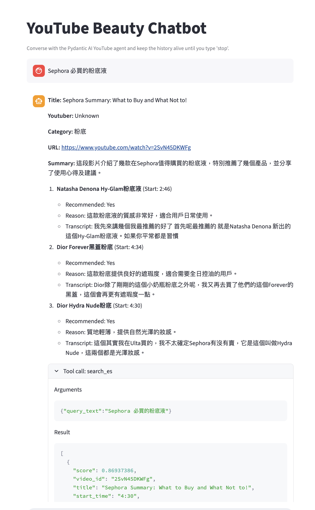

# Beauty Agent

Viewers often spend hours watching long YouTube beauty videos, manually searching for product names, recommendations, and whether the products are suitable for Asian skin tones or specific needs. This research process is slow, repetitive, and lacks a centralized.

Built a multilingual research assistant that ingests beauty YouTube videos, extracts structured product information, and creates a searchable knowledge base with grounded transcript citations.
The agent can:
   - Retrieve relevant product mentions directly from the transcript
   - Provide timestamps showing where the creator discussed each product
   - Summarize why the creator recommends or does not recommend it
   - Provide outputs in English or Chinese depending on the user’s query
   - Dramatically reduce research time by delivering clear, evidence-based answers instantly

## Features
- **Creator ingestion pipeline** – fetch YouTube uploads, download transcripts via Webshare proxies, summarize with OpenAI, and cache overlapping chunks for reuse.
- **Clarify & retrieval agents** – a routing agent decides whether to fetch/index data, while the YouTube agent performs multilingual semantic search (Elasticsearch + SentenceTransformers) and returns product recommendations with timestamps.
- **Interactive surfaces** – CLI loop (`terminal_chatbot.py`) and Streamlit UI (`app.py`) powered by shared agent logic.
- **Evaluation harness** – generate golden answers, replay agent runs, and judge outputs with a rubric (instruction following, answer quality, citation faithfulness).
- **Monitoring-ready** – logs are structured and monitored using `logfire`

## Project Structure
```
health-agent/
├── Makefile                     # Canonical entrypoints (uv run …)
├── app.py / terminal_chatbot.py # Streamlit + CLI frontends
├── main.py                      # Sample orchestration (YouTube agent with streaming output)
├── service/
│   ├── youtube_extraction/      # Data ingestion: parser, chunker, searcher
│   ├── agent/                   # Clarify + YouTube agents
│   └── evals/                   # Ground truth + judging pipelines
├── data/                        # Transcripts, ground-truth CSVs, eval pickles
├── .cache/                      # Chunked transcripts + search indexes
└── notebooks/                   # Experiments and design notes
```
Each service also has its own README with deep dives into scripts, dependencies, and TODOs.

## Environment Setup
1. **Install uv** (if not already): see [uv repo](https://github.com/astral-sh/uv).
2. **Sync dependencies**
   ```bash
   uv sync
   ```
3. **Create `.env` (or export vars)**
   ```
   export GOOGLE_API_KEY=...
   export YOUTUBE_CHANNEL_ID=...
   export OPENAI_API_KEY=...
   export PROXY_USERNAME=...
   export PROXY_PASSWORD=...
   export WEBSHARE_HTTP=...   # optional for translation proxying
   export WEBSHARE_HTTPS=...
   LOGFIRE_TOKEN=...
   ```
4. **Start Elasticsearch** for semantic search:
   ```bash
   docker run -d \
     --name elasticsearch \
     -m 6g \
     -p 9200:9200 \
     -p 9300:9300 \
     -e "discovery.type=single-node" \
     -e "xpack.security.enabled=false" \
     -v es9_data:/usr/share/elasticsearch/data \
     docker.elastic.co/elasticsearch/elasticsearch:9.1.1
   ```

## How to Run
All workflows are wrapped in the `Makefile` (each target uses `uv run …` so the project environment is used automatically):

| Command | What it does |
| --- | --- |
| `make run-get-videos` | Downloads recent videos + transcripts for the configured creator. Triggers ingestion pipeline prerequisites. |
| `make run-data-prep` | Automates the transcript ingestion for the configured creator. |
| `make run-main` | Runs `main.py`, calling YouTube Agent once for a scripted prompt. |
| `make run-terminal-app` | Launches the interactive CLI chatbot loop. |
| `make run-streamlit-app` | Starts the Streamlit UI for browsing recommendations. |
| `make run-ground-truth` | Generates golden answers for evaluation (writes to `data/ground_truth/*.bin`). |
| `make run-ground-truth-evals` | Scores agent outputs against the rubric and prints pass rates. |

Consult individual service READMEs for additional context (custom arguments, helper scripts, etc.).

## Reproducing Results
1. **Ingest data**
   ```bash
   make run-get-videos
   ```
   This populates `data/<creator>/transcript/*.txt` and `data/<creator>/videos/*.json`.

   ```bash
   make run-chunk-videos
   ```
   This populates `.cache/<creator>_<window_size>_<step>/<creator>_<video_id>.json`.
   
2. **Verify Elasticsearch index** (only once per dataset)
   ```python
   from service.youtube_extraction.src.youtube_extraction.youtube_search import YoutuberTranscriptSearcher
   searcher = YoutuberTranscriptSearcher(youtuber="heyitsmindy")
   searcher.ensure_es_index()
   ```
   This creates the ElasticSearch Tool.
3. **Generate ground truth**
   ```bash
   make run-ground-truth
   ```
   Produces `data/ground_truth/eval-run-<timestamp>.bin` containing saved agent answers + logs.
4. **Run evaluations**
   ```bash
   make run-ground-truth-evals
   ```
   Outputs per-check accuracy so you can compare experiments (prompt tweaks, retrieval strategies, chunking changes).

## References & Next Steps
- Service-level documentation:  
  `service/youtube_extraction/README.md`, `service/agent/README.md`, `service/evals/README.md`

## Demo


**Watch My Fun Demo!!!**
- [Terminal Chatbot Video!](https://drive.google.com/file/d/18BRIWoaRMX-jSKmATAg8q8buGl3v8nqD/view?usp=sharing)
- [Streamlit App!](https://drive.google.com/file/d/1V8-E122SjiPKTcOV9tjfqwKsU8BaqpuJ/view?usp=sharing)

**Streamlit UI**


<!--  -->
